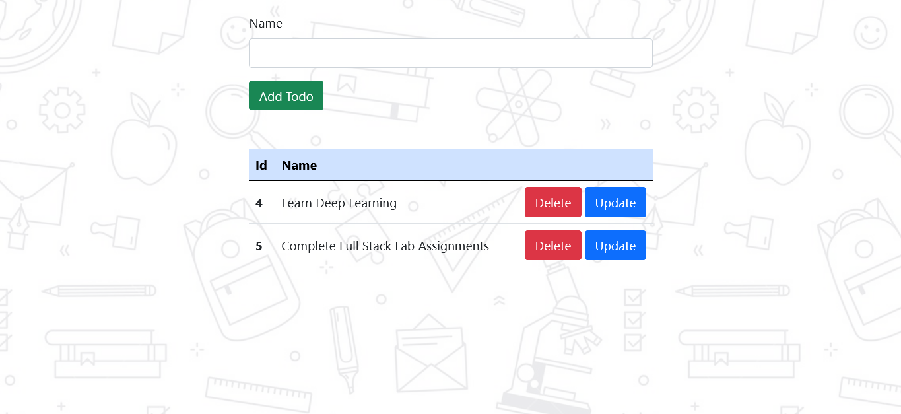

# Todo ASP


Tasks todo web application with a minimal features created using ASP framework.

## Prerequisites

Before you can run this project, you need to have the following installed:

- dotnet SDK (version 7.0 or later)

## Installation

To install this project, follow these steps:
Clone the repository using `git`

```
git clone https://github.com/Prakashdeveloper03/Todo-ASP.git
```

Navigate to the root directory of the project

```
cd <directory_name>
```

To install all the dependencies

```
dotnet restore
```

Run the app

```
dotnet run
```

## Screenshot

